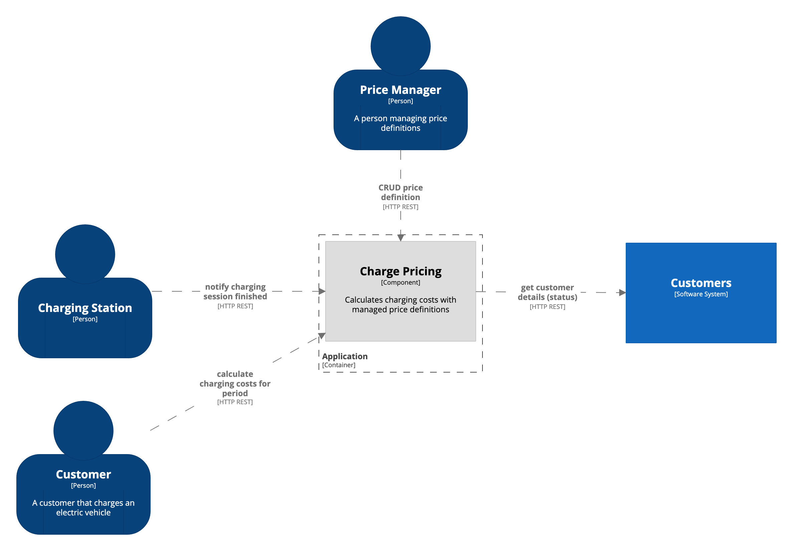
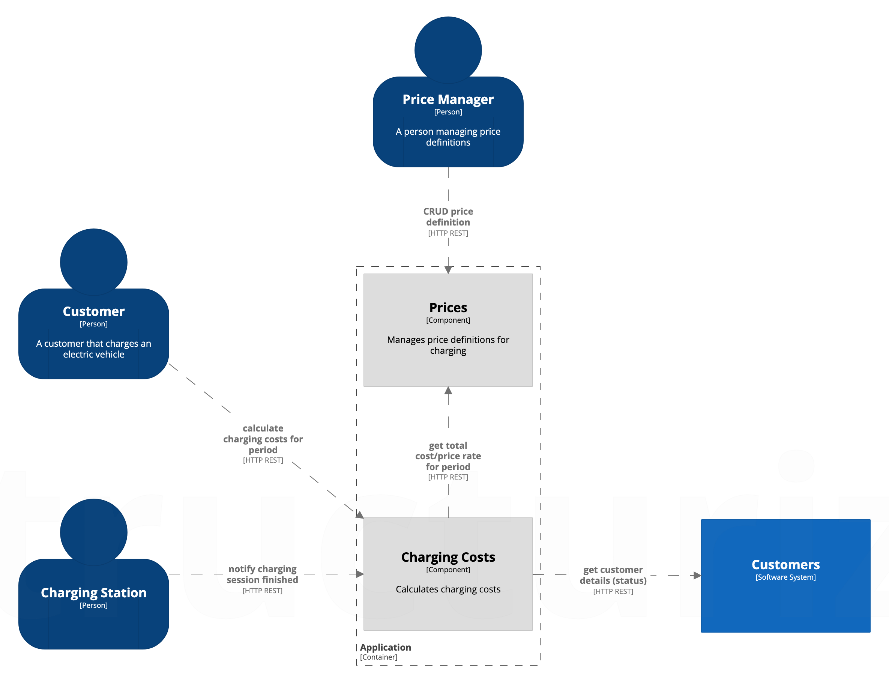

# eCar charge pricing 
eCar company is going to introduce new way pricing in their new, successful backoffice supporting electric vehicles charging network.   
  
## Requirements  
* Ability to define and calculate a price via API.    
* A price definition will contain price per minute and can be defined for specific duration, e.g. one price before noon and different one afternoon   
* A calculation input will contain start and end datetime of charging process and customer id   
* For VIP customers we will grant 10% discount   
* A solution should be provided in a zip file or as a link to git repository   
* An application should be able to be launched from command line with single command like "java –jar...."   
* A solution should require no additional software to be installed except for JRE 8  
  
## Analysis  
We're gonna follow Jakub Nabrdalik's advice and recommendations  
so we're gonna start with gathering the requirements. We're already given  
some basic premise of the applications and the description of what it is supposed to do.  
  
So let's try to formalize it a bit more with BDD scenarios 
and some other techniques to validate that we actually understand the problem   
and know how it's supposed to work, probably refining the whole process with the customer.

Here is a [link](https://docs.google.com/document/d/1tG-fLnFY5s2s_8WMBccpL69KHs7lssSmF07RrqgJixI/edit?usp=sharing)
I sent to the customer to some analysis in the form of BDD scenarios (some are probably missing and 
some require validation from the customer) and some questions I wanted to discuss, verify and 
validate with the customer. But I was told to do it based on my own assumptions.

### Acceptance scenario  
  
1. Given there is a price definition of **1.00$** per minute for **00:00-7:00** 
and **2.00$** for **7:00-14:00** and **3.00$** for **14:00-24:00** time period as of **31.01.2019** 
and another price definition of **0.50$** as of **01.02.2019**
2. And I’m a VIP customer
3. When I calculate possible charging costs for **31.01.2019 12:00 - 02.02.2019 1:30** period 
4. Then it estimates **2524.5$** for the specified period \
(12:00-14:00 2h * 60m * **2$**) + (14:00-24:00 10h * 60m * **3$**) = 2040$ for 31.01.2019 \
(00:00-24:00 24h * 60m * **0.50$**) = 720$ for 01.02.2019 \
(00:00-1:30 1.5h * 60m * **0.50$**) = 45$ for 02.02.2019 \
= 2805$ discounted by 10% = 2524.5
5. When I really start my charging session at **31.01.2019 12:00** and finish at **02.02.2019 01:30**
6. And in the meantime there is a new price definition of **10.00$** per minute added as of **02.02.2019**
7. When my charging costs are calculated 
8. Then they are equal to **3294$** (2040+720+**900** discounted by 10%)

### Assumptions

* Charging costs are calculated according to last known prices
    * could be mitigated by remembering price definitions when the charging session starts 
    and using them later when the charging session is finished. 
    Also some kind of price lifecycle could be considered (like draft and published prices)
* Charging costs calculation has precession of seconds
* Price definition asOf date is considered to be in UTC timezone and charging session period is also shifted to UTC
* Prices are considered to be in dollars
    * could be mitigated by introducing Java Money Api

Other assumptions can be found in the tests **ChargePricingSpec** 
(the test names are phrased as a statement, thus assumption)

## Architecture
After gathering, refining and validating the requirements and scenarios,
lets try to design an appropriate architecture for the **Charge Pricing** domain.

The actors of the system are probably going to stay stable (or more stable) across all the architectures:
* **Customer** that has an electric vehicle and needs to charge it and know charging costs
* **Charging Station** that notifies about finished charging sessions
* **Price Manager** that manages raw charging prices for specific periods

The **Customers** Software System is also going to be considered fixed and external,
because there is no need for us to manage any of the customer information (at least for now).
It's needed for the sole purpose of getting the customer status
that is needed for applying discounts, but in the future we could also anticipate
getting this information from some other sources (e.g. JWT).

What unclear and probably unstable is 
the internal relationship and communication between **Prices** and **Charging Costs**
so different architectural options are what we are going to consider next.

### 1. Single Charge Pricing module

This architecture represents a single module for Charge Pricing
that calculates charging costs with managed price definitions.

Given the nature of our requirements, some of the interactions between **Prices** and **Charge Costs** are unclear
(see [option 2](#2-prices-and-charging-costs-modules-charging-costs-knows-about-the-price-definition-structure) for more details).
That's why I'm a bit reluctant to include those concerns in the high level architecture
setting hard boundaries that we are unsure of. Setting boundaries and splitting the solution into 2 modules
would mean having a contract between them which also means that ideologically we have to mock a module in our tests
(see "Keep IT clean" talk by Jakub Nabrdalik). Also, a module is microservice candidate and I once asked Jakub Nabrdalik 
how to deal with the situation when you have an acceptance test that covers multiple modules
but in the future you might decide to extract a module into its own microservice and it's no longer easy to
run a single acceptance test because now you have 2 applications (probably you would have to spin them up in a docker).
I got an answer from Jakub Nabrdalik that they had moved away from an acceptance test for more than one module - and
this is what I'm going to follow as well.

So, this option is going to hide **Prices** and **Charging Costs** concerns and keep them as an implementation detail
but internally is going to be similar to the [option 2](#2-prices-and-charging-costs-modules-charging-costs-knows-about-the-price-definition-structure) 
or [option 3](#3-prices-and-charging-costs-modules-charging-costs-knows-only-the-total-costprice-rate-for-period).
This will allow us to wait for more requirements/refinements/changes 
and see what direction to take and solidify it in the architecture later.
But of course we have to keep an eye on this architecture not to create a Big Ball of Mud.

* Pros
    * simpler solution
    * have time to mature and not having to set boundaries and contracts too early
    while still maintaining simplicity
    * tests are easier to write compared to multiple modules 

* Cons
    * having one bigger module is more prone to being neglected and turning into a BBOM

### 2. Prices and Charging Costs modules (Charging Costs knows about the price definition structure)


This architecture splits **Charge Pricing** domain into two modules.
* **Prices** module manages price definitions for charging defined by **Price Manager**
* **Charging Costs** module calculates charging costs
 
In order for **Charging Costs** module to do the calculations, 
it gets prices for specific period of time from **Prices** module. And this is where uncertainty lies.
It seems that now **Charging Costs** module have to know the structure of price definitions and deal with
applying them to periods of time and time intervals which might be OK 
since it may be the essential complexity that we can't get rid of (we don't know yet)
but I'm not sure if promoting it to the level of high level architecture is justified just yet 
(again given the nature of our requirements and concerns expressed in the [option 1](#1-single-charge-pricing-module))

* Pros
    * more formalized and detailed communication and structure with more specified responsibilities
    
* Cons
    * the communication, responsibilities and structure may not be stable and mature enough 
    to promote it to the level of high level architecture 
    given some of the business requirements and assumptions are unstable and ambiguous itself
    * bigger structural changes in application code and tests needed if we get the boundaries wrong

### 3. Prices and Charging Costs modules (Charging Costs knows only the total cost/price rate for period)


The only difference compared to the [option 2](#2-prices-and-charging-costs-modules-charging-costs-knows-about-the-price-definition-structure) 
is instead of **Charging Costs** knowing price definitions, it asks only for total costs (or total price rate) for the given period. 
This allowed us to get rid of structural coupling on price definitions
by moving raw total charging cost (or total price rate) calculations (without applying any other rules such as discounts)
to **Prices** module. And now **Charging Costs** module has to apply this total cost (or total price rate) 
and deal with other business rules (such as discounts) and charging sessions.
But it lost the information about calculations for specific periods of times and intervals which might be needed in the future
(we don't know yet). We might try to mitigate it by having **Prices** modules return details of calculations 
but I'm now sure how feasible that is.

* Pros
    * all the pros of [option 2](#2-prices-and-charging-costs-modules-charging-costs-knows-about-the-price-definition-structure)
    * limits structural coupling on price definition

* Cons
    * all the cons of [option 2](#2-prices-and-charging-costs-modules-charging-costs-knows-about-the-price-definition-structure)
    * the scope of communication with **Prices** may be too limiting
    
### Decision on the architecture
Given aforementioned options and their pros and cons, we are going to choose 
[Single Charge Pricing module](#1-single-charge-pricing-module) as a counteract to somewhat ambiguous
future business requirements and assumptions (or maybe I'm just missing something and my reasoning is totally flawed in which case I'm sorry).
This option seems the most simplistic while allowing to more easily adopt to future changes without
committing to hard boundaries on things that are likely to change or that are uncertain (especially given the nature of the new system).

The decision is also recorded in the form of [ADR-0001](docs/decisions_log/0001-choosing_architecture.md) (basically copied from here)

## HTTP API

* **Add a new price definition:**
```json
POST /price-definitions

{
  "asOf": "2019-01-01",
  "pricePerMinute": "1.00",
  "timeInterval": null
}
```

```json
POST /price-definitions

{
  "asOf": "2019-01-01",
  "pricePerMinute": "2.00",
  "timeInterval": {"start": "12:00", "end": "23:59:59.999999999"}
}
```
For end of the day (24:00) the value should be sent as `23:59:59.999999999`

If the price definition for the given asOf date didn't exist before,
it will be created and the pricePerMinute becomes a default for unspecified intervals.


* **Calculate charging costs for a charging session:**
```
GET /charging-costs/calculate?customerId={customerId}&start={start}&end={end}
```
Query params:
* **customerId** is any string, e.g. `regular` or `vip` 
(for the task purposes any id containing `vip` will be considered as a VIP customer
any id containing `regular` will be considered a regular one)
* **start** is an ISO 8601 start date of the charging session, e.g. `2019-01-01T00:00:00Z`
* **end** is an ISO 8601 end date of the charging session, e.g. `2019-01-02T00:00:00Z`

## Build and Run

To build the app, run the following command in the root directory:
```
./gradlew bootJar
```

Then to run the app, run the following (the app will be up and running on port 8080) 
```
java -jar build/libs/ecar-0.0.1-SNAPSHOT.jar 
```